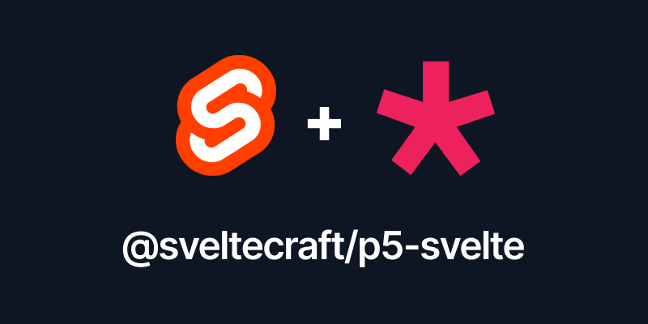

<p align="center">
	
</p>

# @sveltecraft/p5-svelte

A Svelte component wrapper for p5.js sketches.

## Installation

```sh
npm i @sveltecraft/p5-svelte p5
```

## Usage

```svelte
<script lang="ts">
	import P5Sketch, { type Sketch } from '@sveltecraft/p5-svelte'

	let x = 0
	let y = 0
	let diameter = $state(100)

	const sketch: Sketch = (p) => {
		p.setup = () => {
			p.createCanvas(800, 600)
			p.noStroke()
		}
		p.draw = () => {
			p.background(10)
			x = p.lerp(x, p.mouseX, 0.05)
			y = p.lerp(y, p.mouseY, 0.05)
			p.fill(255)
			p.circle(x, y, diameter)
		}
	}
</script>

<P5Sketch {sketch} />

<label>
	diameter
	<input type="range" bind:value={diameter} min={0} max={400} />
	{diameter}
</label>
```

## Addons (p5.sound, etc.)

> ⚠️ **Warning**
> p5.js 2.0+ has a slightly different API than older versions. In the new version, asset preloading is done in `setup` instead of the `preload` function.

In the past `p5.sound` was part of `p5.js` and it was typed using the `@types/p5` package which is no longer the case — `p5.sound` is a standalone package and doesn't include types, so you have to use `any` or create your own types.

Addons like `p5.sound` require access to a global `p5` instance, so we have to dynamically load them using the `addons` array before the sketch initializes:

```svelte
<script lang="ts">
	import P5Sketch, { type Sketch } from '@sveltecraft/p5-svelte'

	// custom sound type
	type SoundFile = {
		play: () => void
	}

	// @ts-expect-error no types
	const addons = [() => import('p5.sound')]

	const sketch: Sketch = (p) => {
		// store sound reference
		let sound: SoundFile
		p.setup = async () => {
			// preload sound
			sound = await (p as any).loadSound('./sfx.mp3')
			p.createCanvas(400, 400)
		}
		p.draw = () => {
			p.background(10)
		}
		p.mousePressed = () => {
			// play sound
			sound.play()
		}
	}
</script>

<P5Sketch {sketch} {addons} />
```

### Why this approach?

Addons like `p5.sound` look for `window.p5` at load time to extend the library. By passing addons as an array, the component:

1. Loads `p5` dynamically
2. Assigns `p5` to `window.p5` before loading addons
3. Waits for all addons to load
4. Then initializes your sketch

This ensures addons are properly registered before your sketch runs.

## API

### Props

- `sketch` (required): A function that receives a p5 instance and defines `setup` and `draw` methods
- `addons` (optional): Array of async functions that load p5 addons
- `style` (optional): CSS styles to apply to the canvas container
- `class` (optional): CSS class to apply to the canvas container
